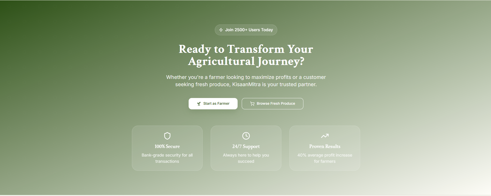
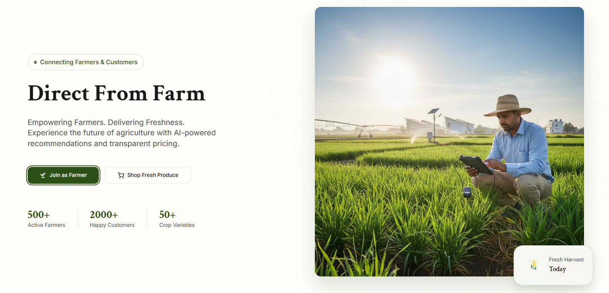
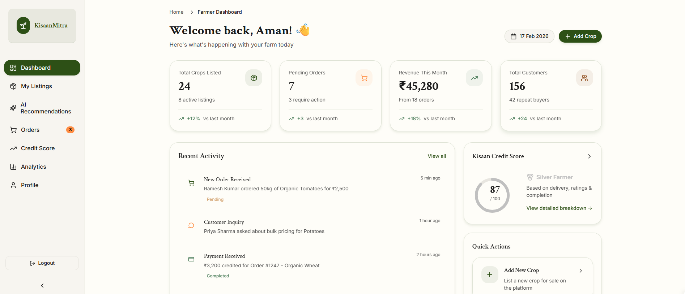

# Kisaan-Mitra-2.0
KisaanMitra is a smart agri-tech platform that bridges the gap between farmers (producers) and customers (consumers) by eliminating middlemen and enabling transparent, data-driven farm-to-home commerce.

It empowers farmers with intelligent insights while delivering fresh produce directly to customers.

---

## 🏠 Landing Page

## 👨‍🌾 Farmer Dashboard

# Login

## 🚀 Problem Statement

- Farmers often don’t receive fair prices.
- Customers pay higher prices due to middlemen.
- Lack of transparency in the supply chain.
- No demand predictability for farmers.
- Food wastage due to poor aggregation.

KisaanMitra solves this with a digital marketplace powered by intelligent demand insights.

---

## ✨ Core Features

### 🧠 Smart Demand Aggregation
- Groups customer orders by crop and location.
- Activates bulk orders when demand threshold is reached.
- Reduces logistics cost.
- Notifies nearby farmers.

---

### 🤖 AI Crop Recommendation
Suggests crops based on:
- Soil type  
- Season  
- Location  
- Budget  
- Previous crop  

Displays:
- Expected profit  
- Demand score  
- Risk level  

---

### ⭐ Kisaan Credit Score
Farmer performance scoring system based on:
- On-time delivery
- Customer ratings
- Order completion rate

Levels:
- 🥇 Gold Farmer (90+)
- 🥈 Silver Farmer (75–89)
- 🥉 Bronze Farmer (60–74)
- ⚠ Needs Improvement (<60)

Higher score → Higher listing priority.

---

### 👨‍🌾 Farmer Dashboard
- Add crops
- View demand insights
- AI recommendations
- Track orders
- View credit score
- Profile management

---

### 🛒 Customer Dashboard
- Browse crops
- Filter by location / price / organic
- View farmer credit score
- Add to cart
- Subscription box option
- Order tracking

---

### 📊 Admin Panel
- Total farmers
- Total customers
- Total orders
- Revenue analytics
- Bulk demand tracking
- User moderation

---

## 🏗 Tech Stack

### Frontend
- React.js
- Tailwind CSS
- Framer Motion

### Backend
- Node.js
- Express.js

### Database
- MongoDB

### Authentication
- JWT-based authentication
- Role-based access (Farmer / Customer / Admin)

---

## 🧩 System Architecture

Client (React)  
⬇  
REST API (Express.js)  
⬇  
MongoDB Database  
AI Logic (Rule-based / ML-ready module)

